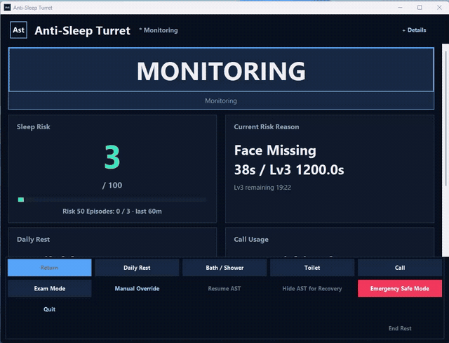
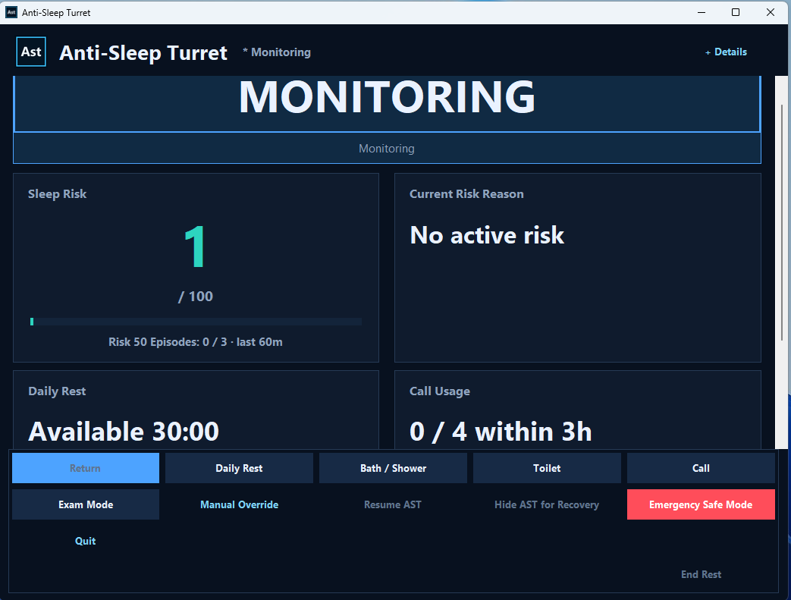
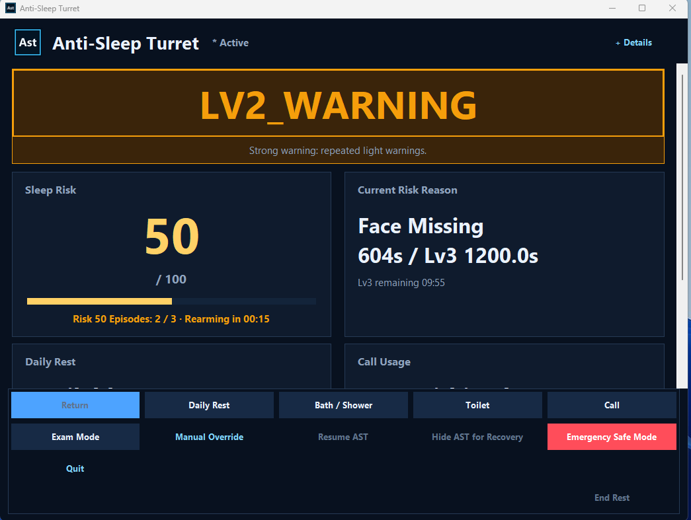
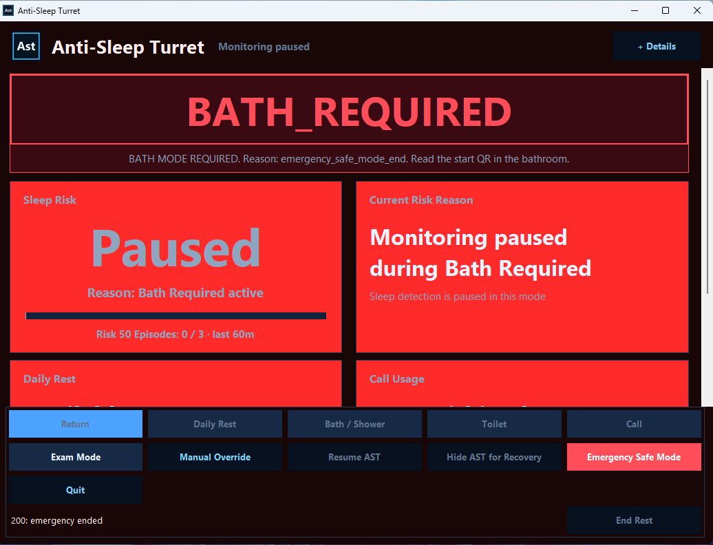
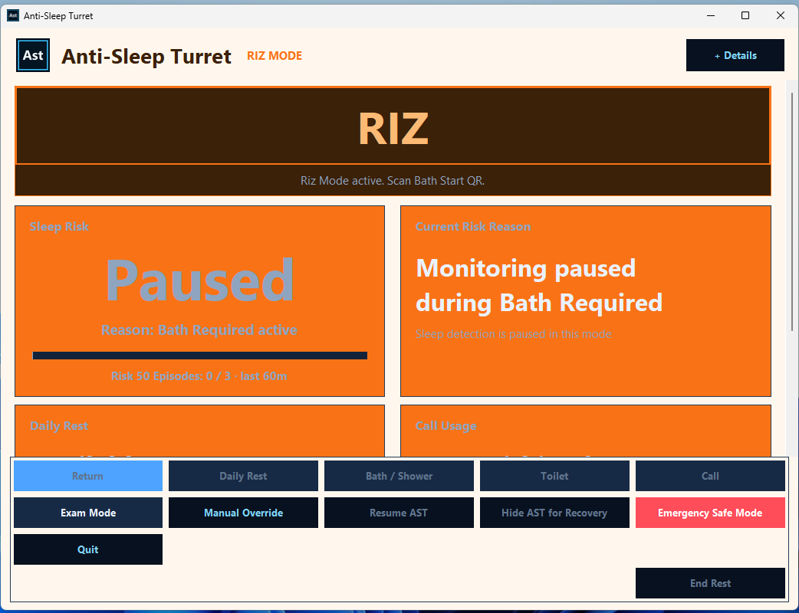

# Anti-Sleep Turret (Ast)

CG制作中の日中の寝落ちを作者本人の設計課題とし、眠気リスク検知から入浴介入までを状態遷移として構成した個人用Windowsプロトタイプです。



> 実運用版UIの約30秒デモです。Monitoring、Sleep Riskの上昇、Lv2 Warning、Bath Startedまでを示します。検出精度や医学的有効性を示す映像ではありません。

## 3つの設計ポイント

- **段階的介入** — 実運用版ではカメラ由来の信号、公開デモでは合成入力からSleep Riskを算出し、Lv1・Lv2警告を経て入浴要求へ遷移します。
- **回避耐性と継続利用の両立** — Risk 50の反復、Presence Guard、通話・休憩・試験などの明示的な例外を、ひとつの状態機械で扱います。
- **安全を強制より上位に置く** — アプリ内制御とは独立したTechnical Safety Cutoffを設計上の外側に置きます。実Windows環境での受け入れ強化は継続中です。

## 私が担ったこと

作者本人が、約4か月の自己管理ログCLLをもとに課題を選び、入浴を中心とする介入方針、段階的な強制力、例外条件、安全優先順位、実機での受け入れ基準を決定しました。ChatGPTは曖昧な要件の仕様化とレビューを、Codexはコーディング、リファクタリング、テスト、CI、Windows向け実装を支援しました。

## Quick Start

Python 3.11以上を使用します。公開版はカメラ、スマートフォン、ネットワーク接続を必要としません。

```powershell
python -m pip install -e .
python -m ast_demo
```

ヘッドレスで決定的シナリオを実行する場合:

```powershell
python -m ast_demo --scenario repeated-risk --headless
```

[](https://github.com/youta-01/anti-sleep-turret-demo/actions/workflows/ci.yml)


## English executive summary

Ast is a sanitized public simulation of an N=1 Windows prototype that connects drowsiness-risk signals to graded warnings and a timed bathing intervention. The portfolio focuses on domain modeling, exception policies, operational iteration, safety boundaries, and human-directed AI-assisted development. It is not a medical product, and current observations do not establish causality, effect size, or general reliability.

## 画面

| 状態 | 画面と説明 |
| --- | --- |
| Monitoring | <br>通常監視UI。現在のSleep RiskとRisk 50 episode countを表示。 |
| Lv2 Warning | <br>Risk 50に到達し、2回のepisodeを記録。次の有効なepisodeでBath Requiredを強制する状態。 |
| Bath Required | <br>Emergency Safe Mode終了後、システムが入浴介入を要求した状態。 |
| Riz | <br>同じBath状態機械を使い、オレンジ色のモード文脈で表示するスマートフォン起点のRiz。 |

動画版: [production-demo.mp4](docs/images/production-demo.mp4)

## 公開版と実運用版

このリポジトリは、主要な状態遷移を安全に確認できるポートフォリオ用デモです。すべての入力は合成イベントで、実カメラ処理、スマートフォン通信、認証情報、個人ログ、ローカル設定、Windowsプロセス制御は含みません。

実運用版では、カメラ入力、QRによるBath開始・完了、Rizの充電継続確認、アラーム、Watchdogなどを組み合わせています。公開版はその中から、説明・テスト可能なドメインロジックだけを再構成しています。

## 設計と検証資料

- [問題と対象ユーザー](docs/problem-and-user.md)
- [現在の公開実装](docs/current-implementation.md)
- [アーキテクチャ](docs/architecture.md)
- [状態遷移](docs/state-transitions.md)
- [BathとRiz](docs/bath-and-riz.md)
- [開発履歴](docs/development-history.md) / [反復履歴](docs/iteration-history.md)
- [実運用上の観察と限界](docs/evidence-and-limitations.md)
- [開発体制とAI活用](docs/ai-collaboration.md)
- [主要な設計判断](docs/decisions/001-bathing-over-alarm-only.md)
- [公開版と非公開版の境界](docs/public-vs-private.md)
- [公開マニフェスト](PUBLIC_RELEASE_MANIFEST.md)

## 検証

ローカルテスト: **54 passed**  
GitHub ActionsはUbuntu / Windows向けに設定済みです。最新状況は上部のCIバッジから確認できます。

```powershell
python -m compileall .
python -m pytest -q
python scripts/verify_public_release.py
```

## 注意

対象ユーザーは作者本人です。運転、産業監視、医療上の診断・治療、他者の制御を目的としません。現在の記録から、医学的有効性、因果効果、効果量、一般利用者への有効性を主張することはできません。

## 権利

現時点ではオープンソースライセンスを付与していません。詳細は[NOTICE.md](NOTICE.md)を参照してください。
