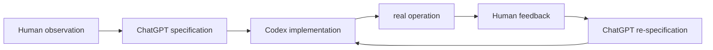

# Human / ChatGPT / Codexの責任分担

## Human-owned

作者が所有し、最終判断したもの:

- プロジェクトが存在する理由
- 問題定義
- CLLの観察
- 介入として入浴を選ぶこと
- 強制と柔軟性の境界
- 例外ポリシー
- Risk反復ポリシー
- 安全優先順位
- 実機での検証
- 最終的な公開境界

## ChatGPT-assisted

- 曖昧な要件を明示的な仕様へ変換
- 仕様間の矛盾検出
- トレードオフのレビュー
- 実装指示の生成
- コードと回帰リスクの確認

## Codex-assisted

- コーディング
- 複数ファイルにまたがる実装
- リファクタリング
- テスト生成
- CI
- Windowsスクリプト
- ドキュメントの骨組み作成

## 開発ループ

Codexは実装を加速しましたが、作者の目標、介入ポリシー、安全優先順位、受け入れ基準を選んだわけではありません。AI支援は設計・実装作業を補助し、作者が現実の観察と最終責任を保持しました。
