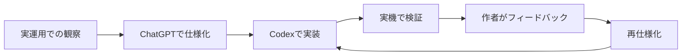

# 開発体制とAI活用

## 作者が担った判断

作者が最終的に決定したもの:

- プロジェクトを作る理由と対象課題
- CLLの観察から何を設計対象にするか
- 介入として入浴を選ぶこと
- 強制力と継続利用可能性の境界
- 通話・休憩・試験などの例外ポリシー
- Risk反復ポリシー
- 安全を強制より優先する判断
- 実機での検証と受け入れ基準
- 公開する情報と非公開にする情報

## ChatGPTによる支援

- 曖昧な要件を、状態・条件・例外・受け入れ基準へ分解
- 仕様間の矛盾と設計上のリスクをレビュー
- 実装指示と回帰テスト観点を作成
- 実運用で見つかった問題を再仕様化

## Codexによる支援

- PythonコードとWindows向けスクリプトの実装
- 複数ファイルにまたがる修正とリファクタリング
- 単体テスト、回帰テスト、CIの作成
- 公開版コードとドキュメントの初期構築

## 開発ループ

Codexは実装速度を高めましたが、作者の目標、介入方針、安全優先順位、受け入れ基準を選んだわけではありません。AI支援を利用しつつ、現実の観察、仕様判断、公開責任は作者が保持しています。
