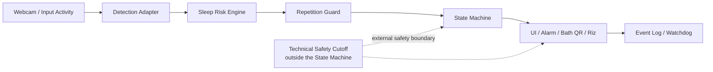
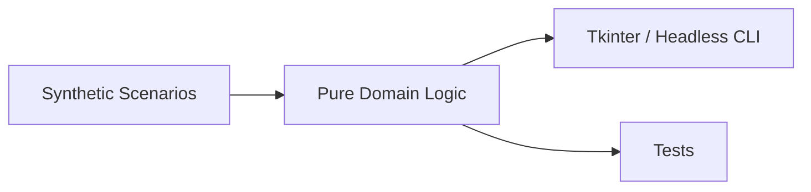

# 現在のアーキテクチャ

## 実運用コンセプト

実運用側は入力の取得、リスク判定、反復判定、状態遷移、介入、運用監視を分離します。Technical Safety Cutoffはアプリ自身の不具合からも到達できるよう、State Machineの外側に置く設計です。

公開文書では、非公開の通信先、認証情報、QR内容、具体的な停止コマンドを示しません。

## 公開デモ

公開デモは実機アダプターを持たず、合成シナリオを純粋なドメインロジックへ入力します。同じロジックをTkinter UIとヘッドレスCLIから実行し、テストで結果を固定します。

この境界により、状態設計は説明・検証できる一方、個人データや実運用の制御経路は公開しません。
