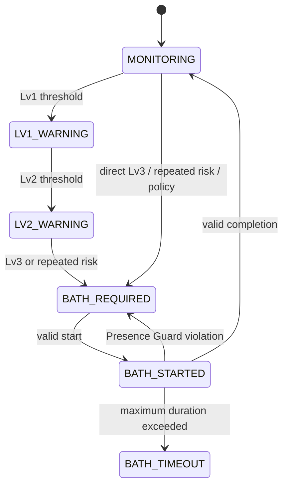

# 現在の状態遷移

## 標準フロー

警告入力が解消した場合、`LV1_WARNING` または `LV2_WARNING` から `MONITORING` に戻れます。上図は主要な介入経路を読みやすく示したもので、例外モードの詳細は [BathとRiz](bath-and-riz.md) に分けています。

## 廃止設計について

以前のバージョンでは Return to PC と Recovery Work を試しました。これらは非公開プロトタイプに休眠中の互換コードとして残っていますが、現行の標準フローおよび公開デモの一部ではありません。そのため、現在の状態図には表示しません。
